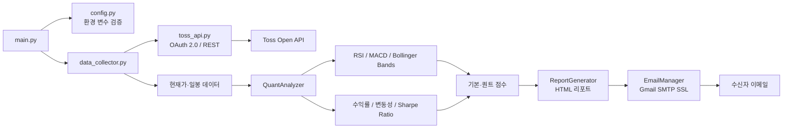

# Investment-email

Toss증권 Open API를 활용하는 기본·퀀트 투자분석 보고서 프로젝트입니다.

## 주요 기능

## 1. 기술 스택

| 구분 | 기술 | 사용 목적 |
| --- | --- | --- |
| Language | Python 3.11+ | API 연동부터 분석, 리포트 발송까지 한 언어로 구현 |
| HTTP Client | Requests | Toss OAuth 인증 및 시세·차트 API 호출 |
| Data Analysis | Pandas, NumPy | 시계열 데이터 처리와 수익률·변동성·Sharpe Ratio 계산 |
| Configuration | python-dotenv | `.env` 기반 비밀값 및 실행 설정 관리 |
| Report | Python 표준 `html`, `email` | HTML 리포트 생성 및 MIME 메시지 구성 |
| Delivery | Gmail SMTP over SSL | 분석 결과 이메일 발송 |
| Deployment | Docker, Docker Compose | 실행 환경 고정 및 반복 가능한 배포 |
| Automation | Batch, PowerShell | Windows 개발 환경 설정과 로컬 실행 보조 |

## 2. 기술 선택 이유

### Python

금융 데이터 분석 생태계가 풍부하고, 외부 API 호출부터 DataFrame 기반 지표 계산과 자동화까지 짧은 코드로 연결할 수 있어 선택했습니다. 분석 로직을 `QuantAnalyzer`로 분리해 이후 백테스트나 추가 지표를 확장하기도 쉽습니다.

### Requests

Toss API의 OAuth 2.0 토큰 발급과 REST 요청 흐름을 직접 제어하기 위해 사용했습니다. 공통 `_request` 메서드에 인증 헤더, timeout, 응답 파싱, HTTP 오류 로깅을 모아 API 어댑터의 일관성을 유지했습니다.

### Pandas와 NumPy

가격·거래량처럼 순서가 중요한 시계열 데이터를 DataFrame으로 다루고, rolling/ewm 연산으로 RSI, MACD, Bollinger Bands를 계산하기 위해 선택했습니다. NumPy는 연환산 변동성과 Sharpe Ratio 계산에 활용합니다.

### 환경 변수 기반 설정

API Client Secret과 Gmail 앱 비밀번호를 소스 코드에서 분리하고, 개발·운영 환경마다 예산과 종목 수를 다르게 주입할 수 있도록 `python-dotenv`를 사용했습니다.

### Docker Compose

로컬 Python 버전과 패키지 차이로 인한 실행 편차를 줄이고, 환경 변수를 주입한 동일한 실행 단위를 만들기 위해 Docker를 지원합니다.

## 3. 아키텍처

### 전체 처리 흐름



### 모듈 책임

```text
main.py                            전체 workflow 오케스트레이션
config.py                          환경 변수 파싱 및 런타임 설정 검증
api/toss_api.py                    OAuth 토큰, 종목 마스터, 현재가, 일봉 API 어댑터
data/data_collector.py             시장별 후보 탐색 및 종목 데이터 수집
analysis/quant_analyzer.py         기술 지표, 통계값, 매수·매도 신호 계산
communication/report_generator.py  HTML 분석 리포트 생성
communication/email_manager.py     Gmail SMTP를 통한 리포트 발송
docker/                            Dockerfile 및 Compose 실행 설정
scripts/                           Windows 가상환경·로컬 실행 보조 스크립트
```

### 종목 선정 및 분석 로직

1. KOSPI, KOSDAQ, NYSE, NASDAQ 종목 마스터에서 최대 `SYMBOL_SCAN_LIMIT`개 후보를 조회합니다.
2. 각 후보의 현재가와 최근 30일 일봉 데이터를 수집합니다.
3. 30일 수익률, 거래량 비율, 연환산 변동성과 함께 RSI, MACD, Bollinger Bands, Sharpe Ratio를 계산합니다.
4. 지표별 조건을 점수화하고 상위 `MAX_SELECTED_STOCKS`개를 선정합니다. 사용자가 지정한 추가 종목은 분석 가능한 경우 선정 목록에 합류합니다.
5. 신호 강도에 따라 `BUY`(60 이상), `HOLD`(41~59), `SELL`(40 이하)로 분류하고 HTML 리포트를 만들어 이메일로 발송합니다.

## 4. 주요 기능

- **Toss API 연동**: OAuth 2.0 Client Credentials 방식으로 토큰을 발급하고 종목 마스터·현재가·일봉 캔들을 조회합니다.
- **인증 만료 대응**: API가 401을 반환하면 access token을 폐기하고 토큰을 한 번 재발급한 뒤 원 요청을 재시도합니다.
- **다시장 후보 탐색**: KOSPI, KOSDAQ, NYSE, NASDAQ을 순회하고 중복 종목을 제거합니다.
- **기술적 분석**: RSI, MACD, Bollinger Bands로 과매수·과매도와 추세 신호를 계산합니다.
- **통계 기반 분석**: 30일 수익률, 연환산 변동성, Sharpe Ratio, 거래량 비율을 계산합니다.
- **예산 기반 필터링**: 투자 예산과 종목당 최대 투자 비율을 설정으로 관리하고, 지표 점수 기반으로 후보를 정렬합니다.
- **HTML 이메일 리포트**: 종목별 추천, 신뢰도, 지표, 긍정 요인, 위험 요소, 목표가와 손절 기준을 HTML로 구성합니다.
- **실패 격리와 로깅**: 개별 종목 수집 실패는 전체 workflow와 분리하고, 파일·콘솔 로그에 원인을 남깁니다.
- **실행 환경 지원**: 일반 Python 실행, Windows Batch, Docker Compose 방식을 제공합니다.

## 5. 트러블슈팅

### `TOSS_CLIENT_ID / TOSS_CLIENT_SECRET` 오류

`.env`가 프로젝트 루트에 있고 두 값이 실제 발급값인지 확인합니다. `env.example`을 복사한 직후에는 placeholder 값을 실제 키로 교체해야 합니다.

```powershell
copy env.example .env
```

### Toss API에서 401이 반복되는 경우

Client ID/Secret, `TOSS_TOKEN_URL`, `TOSS_BASE_URL`을 확인합니다. 시스템은 401 응답에 대해 토큰을 한 번 재발급하지만, 잘못된 자격 증명이나 API 엔드포인트 변경까지 해결하지는 않습니다. `trading_system.log`에서 토큰 발급 실패와 요청 경로를 함께 확인합니다.

### 분석 가능한 종목이 없는 경우

종목 마스터 API가 빈 응답을 반환했거나 현재가 조회가 실패한 상태입니다. API 권한과 네트워크 연결을 확인하고 `SYMBOL_SCAN_LIMIT`을 과도하게 높이지 않았는지 확인합니다. 일봉 데이터가 부족한 종목은 분석 결과에서 제외될 수 있습니다.

### Gmail 발송이 실패하는 경우

일반 Gmail 비밀번호가 아니라 2단계 인증이 활성화된 계정의 앱 비밀번호를 `GMAIL_APP_PASSWORD`에 설정해야 합니다. `GMAIL_ADDRESS`와 `RECIPIENT_EMAIL`에 공백이 없는지도 확인합니다. 이메일 설정이 없으면 분석은 진행되지만 발송은 실패 로그를 남깁니다.

### Docker에서 환경 변수가 적용되지 않는 경우

Compose 파일을 실행하는 위치와 `.env` 위치를 확인합니다. 이 프로젝트는 루트의 `.env`를 준비한 뒤 `docker` 디렉터리에서 Compose를 실행하는 방식입니다.

```powershell
copy env.example .env
cd docker
docker compose up --build
```

## 6. 실행 방법

### 사전 준비

- Python 3.11 이상
- Toss증권 Open API Client ID와 Client Secret
- 이메일 발송이 필요하다면 2단계 인증이 활성화된 Gmail 앱 비밀번호

### 1) 환경 변수 설정

프로젝트 루트에서 예시 파일을 복사하고 값을 입력합니다.

```powershell
copy env.example .env
```

주요 설정은 다음과 같습니다.

```env
TOSS_CLIENT_ID=your_toss_client_id
TOSS_CLIENT_SECRET=your_toss_client_secret
TOSS_BASE_URL=https://api.tossinvest.com
TOSS_TOKEN_URL=https://api.tossinvest.com/oauth2/token
GMAIL_ADDRESS=your@gmail.com
GMAIL_APP_PASSWORD=your_gmail_app_password
RECIPIENT_EMAIL=recipient@gmail.com
TRADING_BUDGET=1000000
MAX_POSITION_RATIO=0.5
MAX_SELECTED_STOCKS=5
SYMBOL_SCAN_LIMIT=400
LOG_LEVEL=INFO
```

### 2) Python으로 실행

```powershell
python -m venv .venv
.\.venv\Scripts\Activate.ps1
pip install -r requirements.txt
python main.py
```

PowerShell 실행 정책에 막히는 경우에는 저장소의 보조 스크립트를 사용할 수 있습니다.

```powershell
powershell -ExecutionPolicy Bypass -File .\scripts\set_env_example.ps1
```

### 3) Windows 스크립트로 실행

```bat
scripts\setup_venv.bat
scripts\run_local.bat
```

### 4) Docker로 실행

```powershell
copy env.example .env
cd docker
docker compose up --build
```

백그라운드 실행, 로그 확인, 종료는 다음과 같습니다.

```powershell
docker compose up -d --build
docker compose logs -f
docker compose down
```

## 문서

- [설정 가이드](docs/setup.md)
- [아키텍처 문서](docs/architecture.md)
- [보안 가이드](docs/secrets.md)
- [환경 변수 예시](env.example)

## 제한 사항 및 운영 주의

- 과거 가격 데이터와 기술 지표를 이용한 참고용 분석이며 미래 수익을 보장하지 않습니다.
- Toss API의 인증 방식과 응답 스키마가 변경될 수 있으므로 운영 전 공식 문서와 실제 응답을 검증해야 합니다.
- `.env`와 API 키, Gmail 앱 비밀번호는 저장소에 커밋하지 않습니다.
- `main.py`: 전체 워크플로 실행
- `config.py`: 환경변수와 투자 설정
- `api/toss_api.py`: Toss증권 API 어댑터
- `data/data_collector.py`: 데이터 수집기
- `analysis/quant_analyzer.py`: 퀀트 분석
- `analysis/quant_analyzer.py`: 퀀트 분석
- `communication/`: 이메일 및 리포트

## 준비 사항
1. Python 3.11 이상 권장
2. Toss증권 Open API Client ID / Client Secret 발급

## 환경 변수 예시
실제 키는 코드에 직접 넣지 말고 `.env` 파일에 넣으세요. 프로젝트 루트에 `.env`를 만들고 아래처럼 설정합니다.

```env
APP_ENV=production

TOSS_CLIENT_ID=your_toss_client_id_here
TOSS_CLIENT_SECRET=your_toss_client_secret_here
TOSS_BASE_URL=https://api.tossinvest.com
TOSS_TOKEN_URL=https://api.tossinvest.com/oauth2/token

GMAIL_ADDRESS=your@gmail.com
GMAIL_APP_PASSWORD=your_app_password
RECIPIENT_EMAIL=your@gmail.com

TRADING_BUDGET=1000000
MAX_POSITION_RATIO=0.5
MAX_SELECTED_STOCKS=5
LOG_LEVEL=INFO
```

PowerShell에서 바로 만들려면:

```powershell
powershell -ExecutionPolicy Bypass -File .\scripts\set_env_example.ps1
```

## 실행 방법

이 시스템은 주문이나 결제를 실행하지 않고, Toss 시세·차트 기반 분석 보고서만 생성합니다.

### 로컬 실행

```bash
pip install -r requirements.txt
python main.py
```

### Windows에서 바로 실행

```bat
scripts\setup_venv.bat
scripts\run_local.bat
```

### Docker 실행

먼저 루트에 `.env`를 준비하세요. 실제 보안값은 코드에 넣지 않고 `.env`에만 넣습니다.

```bash
copy env.example .env
```

그 다음 Docker 컨테이너를 실행합니다.

```bash
cd docker
docker compose up --build
```

백그라운드로 실행하려면:

```bash
cd docker
docker compose up -d --build
```

실행 상태 확인:

```bash
cd docker
docker compose ps
```

로그 확인:

```bash
cd docker
docker compose logs -f
```

중지:

```bash
cd docker
docker compose down
```

재빌드:

```bash
docker compose build --no-cache
```

## 문서
- [docs/README.md](docs/README.md): 문서 인덱스
- [docs/setup.md](docs/setup.md): 설치 및 환경 변수 설정
- [docs/architecture.md](docs/architecture.md): 프로젝트 구조와 흐름
- [env.example](env.example): 환경 변수 예시

## 참고
- 이 프로젝트는 Toss증권 Open API 인증 방식에 맞춰 설계되었습니다.
- 실제 주문은 API 문서 기준의 엔드포인트와 응답 구조를 따라야 하며, 운영 전 문서와 함께 테스트가 필요합니다.
- 일부 도구는 실제 API가 없을 경우에도 로컬 테스트가 가능하도록 기본 폴백을 두고 있습니다.


Toss 차트
├─ 30일 수익률
├─ RSI
├─ MACD
├─ 볼린저 밴드
├─ 변동성
├─ Sharpe Ratio
├─ 거래량 비율
└─ 기술 신호 강도

추가 필터
├─ 예산 범위
├─ 종목당 투자 한도
└─ 기본 점수 기반 fallback 선정

외부 보조 데이터
└─ Toss 현재가·일봉 차트